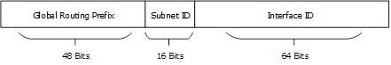
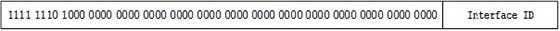
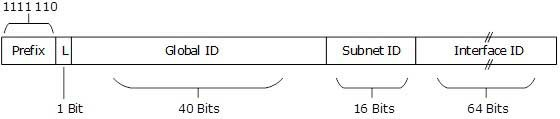
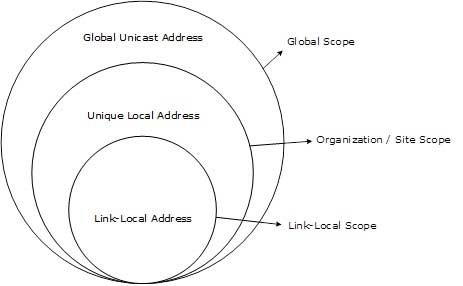

.. This work is licensed under a Creative Commons Attribution 4.0 International License.
.. http://creativecommons.org/licenses/by/4.0
.. (c) Prakash Ramchandran

===============
Docker IPv6 NAT
===============

--------------------------------------------------
What is the Issue with Using IPv6 with Containers?
--------------------------------------------------

Initially Docker was not created with IPv6 in mind. It was added later. As a
result, there are still several unresolved issues as to how IPv6 should be used
in a containerized world.

Currently, you can let Docker give each container an IPv6 address from your
(public) pool, but this has disadvantages (Refer  to [1]_):

* Giving each container a publicly routable address means all ports (even
  unexposed / unpublished ports) are suddenly reachable by everyone, if no
  additional filtering is done.
* By default, each container gets a random IPv6 address, making it impossible
  do DNS properly. An alternative is to assign a specific IPv6 address to each
  container, but it is still an administrative hassle.
* Published ports won't work on IPv6, unless you have the userland proxy
  enabled (which, for now, is enabled by default in Docker)
* The userland proxy, however, seems to be on its way out and has various
  issues, such as:
  * It can use a lot of RAM.
  * Source IP addresses are rewritten, making it completely unusable for many
    purposes, e.g. mail servers.

IPv6 for Docker can (depending on your setup) be pretty much unusable and
completely inconsistent with the way how IPv4 works. Docker images are mostly
designed with IPv4 NAT in mind. NAT provides a layer of security allowing only
published ports through. Letting container link to user-defined networks
provide inter-container communication. This does not go hand in hand with the
way Docker IPv6 works, requiring image maintainers to rethink/adapt their
images with IPv6 in mind.

----------------------
Why not IPv6 with NAT?
----------------------

So why not try resolve above issues by managing ``ip6tables`` to setup IPv6 NAT
for your containers, like how it is done by the Docker daemon for IPv4. This
requires a locally reserved address like we do for private IP in IPv4. These
are called in IPv6 as local unicast Ipv6 address. Let’s first understand IPv6
addressing scheme.

We note that there are 3 types of IPv6 addresses, and all use last or least
significant 64 bits as Interface ID derived by splitting 48-bit MAC address
into 24 bits + 24 bits and insert an FE00 hexadecimal number in between those
two and inverting the most significant bit to create an equivalent 64-bit MAC
called EUI-64 bit. Refer to [2]_ for details.

**1. Global Unicast Address**

This is equivalent to IPv4’s public address with always 001 as Most
Significant bits of Global Routing Prefix. Subnets are 16 opposed to 8 bits
in IPv4.

**2. Link-Local Address**

Link-local addresses are used for communication among IPv6 hosts on a link
(broadcast segment) only. These addresses are not routable. This address always
starts with FE80. These are used for generating IPv6 addresses and 48 bits
following FE80 are always set to 0. Interface ID is usual EUI-64 generated from
MAC address on the NIC.

**3. Unique-Local Address**

This type of IPv6 address is globally unique & used only in site local
communication. The second half of this address contain Interface ID and the
first half is divided among Prefix, Local Bit, Global ID and Subnet ID.

Prefix is always set to 1111 110. L bit, is set to 1 if the address is locally
assigned. So far, the meaning of L bit to 0 is not defined. Therefore, Unique
Local IPv6 address always starts with ‘FD’.

IPv6 addresses of all types are assigned to interfaces, not nodes (hosts). An
IPv6 unicast address refers to a single interface. Since each interface belongs
to a single node (host), any of that node's interfaces' unicast addresses may
be used as an identifier for the node(host). For IPv6 NAT we prefer site scope
to be within site scope using unique local address, so that they remain private
within the organization.

   Figure 1: Scope of IPv6 Unicast Addresses

Based on the IPv6 scope now question arises as what is needed to be mapped to
what? Is it IPv6 to IPv4 or IPv6 to IPv6 with post? Thus, we land up with are
we talking NAT64 with dual stack or just NAT66. Is it a standard that is agreed
upon in IETF RFCs? Dwelling into questions bring us back to should we
complicate life with another docker-ipv6nat?

The conclusion is simple: it is not worth it and it is highly recommended that
you go through the blog listed below [3]_.

----------
Conclusion
----------

As IPv6 Project team in OPNFV, we recommend that IPv6 NAT is not worth the
effort and should be discouraged. As part of our conclusion, we recommend that
please do not use IPv6 NAT for containers for any NFV use cases.

----------
References
----------

.. [1] https://github.com/robbertkl/docker-ipv6nat
.. [2] https://www.tutorialspoint.com/ipv6/ipv6_special_addresses.htm
.. [3] http://ipv6friday.org/blog/2011/12/ipv6-nat/
