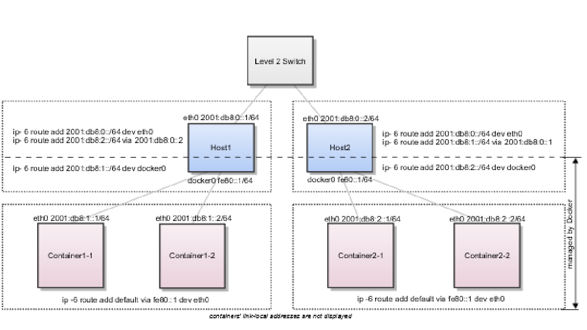
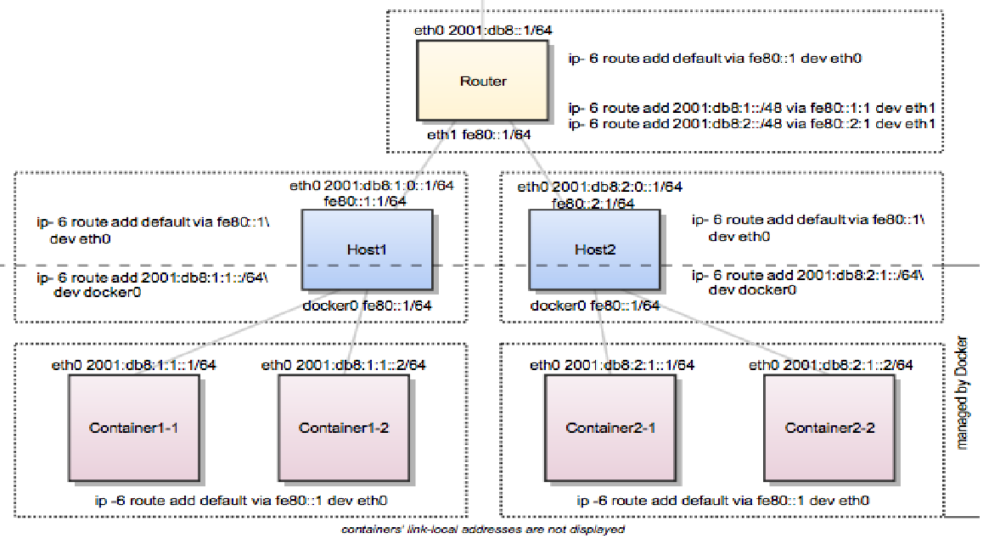

.. This work is licensed under a Creative Commons Attribution 4.0 International License.
.. http://creativecommons.org/licenses/by/4.0
.. (c) Prakash Ramchandran

===================================
Docker IPv6 Simple Cluster Topology
===================================

Using external switches or routers allows you to enable IPv6 communication
between containers on different hosts. We have two physical hosts: Host1 &
Host2, and we will study here two scenarios: one with Switch and the other
one with router on the top of hierarchy connecting those 2 hosts. Both hosts
host a pair of containers in a cluster. The contents are borrowed from
article [1]_ below, which can be used on any Linux distro (CentOS, Ubuntu,
OpenSUSE etc) with latest kernel. A sample testing is pointed in the blog
article [2]_ as a variation using ESXi & older Ubuntu 14.04.

----------------------------
Switched Network Environment
----------------------------

Using routable IPv6 addresses allows you to realize communication between
containers on different hosts. Let’s have a look at a simple Docker IPv6
cluster example:

   Figure 1: An Docker IPv6 Cluster Example

The Docker hosts are in the ``2001:db8:0::/64`` subnet. Host1 is configured to
provide addresses from the ``2001:db8:1::/64`` subnet to its containers. It has
three routes configured:

* Route all traffic to ``2001:db8:0::/64`` via eth0
* Route all traffic to ``2001:db8:1::/64`` via docker0
* Route all traffic to ``2001:db8:2::/64`` via Host2 with IP ``2001:db8:0::2``

Host1 also acts as a router on OSI layer 3. When one of the network clients
tries to contact a target that is specified in Host1’s routing table, Host1
will forward the traffic accordingly. It acts as a router for all networks it
knows: ``2001:db8::/64``, ``2001:db8:1::/64``, and ``2001:db8:2::/64``.

On Host2, we have nearly the same configuration. Host2’s containers will get
IPv6 addresses from ``2001:db8:2::/64``. Host2 has three routes configured:

* Route all traffic to ``2001:db8:0::/64`` via eth0
* Route all traffic to ``2001:db8:2::/64`` via docker0
* Route all traffic to ``2001:db8:1::/64`` via Host1 with IP ``2001:db8:0::1``

The difference to Host1 is that the network ``2001:db8:2::/64`` is directly
attached to Host2 via its docker0 interface, whereas Host2 reaches
``2001:db8:1::/64`` via Host1’s IPv6 address ``2001:db8:0::1``.

This way every container can contact every other container. The containers
Container1-* share the same subnet and contact each other directly. The traffic
between Container1-* and Container2-* will be routed via Host1 and Host2
because those containers do not share the same subnet.

In a switched environment every host must know all routes to every subnet.
You always must update the hosts’ routing tables once you add or remove a host
to the cluster.

Every configuration in the diagram that is shown below the dashed line across
hosts is handled by Dockeri, such as the docker0 bridge IP address
configuration, the route to the Docker subnet on the host, the container IP
addresses and the routes on the containers. The configuration above the line
across hosts is up to the user and can be adapted to the individual environment.

--------------------------
Routed Network Environment
--------------------------

In a routed network environment, you replace the layer 2 switch with a layer 3
router. Now the hosts just must know their default gateway (the router) and the
route to their own containers (managed by Docker). The router holds all routing
information about the Docker subnets. When you add or remove a host to this
environment, you just must update the routing table in the router instead of on
every host.

   Figure 2: A Routed Network Environment

In this scenario, containers of the same host can communicate directly with
each other. The traffic between containers on different hosts will be routed
via their hosts and the router. For example, packet from Container1-1 to
Container2-1 will be routed through Host1, Router, and Host2 until it arrives
at Container2-1.

To keep the IPv6 addresses short in this example a ``/48`` network is assigned
to every host. The hosts use a ``/64`` subnet of this for its own services and
one for Docker. When adding a third host, you would add a route for the subnet
``2001:db8:3::/48`` in the router and configure Docker on Host3 with
``--fixed-cidr-v6=2001:db8:3:1::/64``.

Remember the subnet for Docker containers should at least have a size of
``/80``. This way an IPv6 address can end with the container’s MAC address and
you prevent NDP neighbor cache invalidation issues in the Docker layer. So if
you have a ``/64`` for your whole environment, use ``/76`` subnets for the
hosts and ``/80`` for the containers. This way you can use 4096 hosts with 16
``/80`` subnets each.

Every configuration in the diagram that is visualized below the dashed line
across hosts is handled by Docker, such as the docker0 bridge IP address
configuration, the route to the Docker subnet on the host, the container IP
addresses and the routes on the containers. The configuration above the line
across hosts is up to the user and can be adapted to the individual environment.

----------
References
----------

.. [1] https://docs.docker.com/v17.09/engine/userguide/networking/default_network/ipv6/#docker-ipv6-cluster
.. [2] http://www.debug-all.com/?p=128
