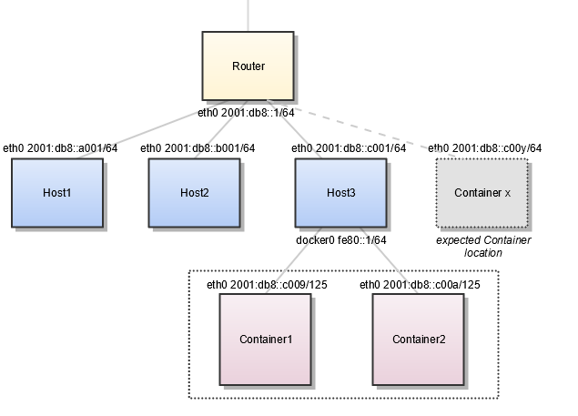

.. This work is licensed under a Creative Commons Attribution 4.0 International License.
.. http://creativecommons.org/licenses/by/4.0
.. (c) Prakash Ramchandran

==============
ICMPv6 and NDP
==============

ICMP is a control protocol that is considered to be an integral part of IP,
although it is architecturally layered upon IP, i.e., it uses IP to carry its
data end-to-end just as a transport protocol like TCP or UDP does. ICMP
provides error reporting, congestion reporting, and first-hop gateway
redirection.

To communicate on its directly-connected network, a host must implement the
communication protocol used to interface to that network. We call this a link
layer or media-access layer protocol.

ICMPv6 is used instead of ARP as in IPv4, with following Neighbor Discovery
Protocol (NDP) options.

NDP defines five ICMPv6 packet types for the purpose of router solicitation,
router advertisement, neighbor solicitation, neighbor advertisement, and
network redirects. Refer RFC 122 & 3122.

Contrasting with ARP, NDP includes Neighbor Unreachability Detection (NUD),
thus, improving robustness of packet delivery in the presence of failing
routers or links, or mobile nodes. As long as hosts were using single network
interface, the isolation between local network and remote network was simple.
With requirements of multihoming for hosts with multiple interfaces and
multiple destination packet transfers, the complications of maintaining all
routing to remote gateways has disappeared.

To add container network to local network and IPv6 link local networks and
virtual or logical routing on hosts, the complexity is now exponential.
In order to maintain simplicity of end hosts (physical, virtual or containers),
just maintaining sessions and remote gateways (routers), and maintaining routes
independent of session state is still desirable for scaling internet connected
end hosts.

For more details, please refer to [1]_.

-----------------------------------------
IPv6-only Containers & Using NDP Proxying
-----------------------------------------

IPv6-only containers will need to fully depend on NDP proxying.

If your Docker host is the only part of an IPv6 subnet but does not have an
IPv6 subnet assigned, you can use NDP Proxying to connect your containers to
the internet via IPv6.

If the host with IPv6 address ``2001:db8::c001`` is part of the subnet
``2001:db8::/64``, and your IaaS provider allows you to configure the IPv6
addresses ``2001:db8::c000 to 2001:db8::c00f``, your network configuration may
look like the following:

.. code-block:: bash

    $ ip -6 addr show

    1: lo: <LOOPBACK,UP,LOWER_UP> mtu 65536
       inet6 ::1/128 scope host
          valid_lft forever preferred_lft forever
    2: eth0: <BROADCAST,MULTICAST,UP,LOWER_UP> mtu 1500 qlen 1000
       inet6 2001:db8::c001/64 scope global
          valid_lft forever preferred_lft forever
       inet6 fe80::601:3fff:fea1:9c01/64 scope link
          valid_lft forever preferred_lft forever

To split up the configurable address range into two subnets
``2001:db8::c000/125 and 2001:db8::c008/125``, use the following daemon.json
settings.

.. code-block:: bash

    {
      "ipv6": true,
      "fixed-cidr-v6": "2001:db8::c008/125"
    }

The first subnet will be used by non-Docker processes on the host, and the
second will be used by Docker.

   Figure: Using NDP Proxying

For more details, please refer to [2]_.

----------
References
----------

.. [1] https://en.wikipedia.org/wiki/Neighbor_Discovery_Protocol
.. [2] https://docs.docker.com/v17.09/engine/userguide/networking/default_network/ipv6/#using-ndp-proxying

