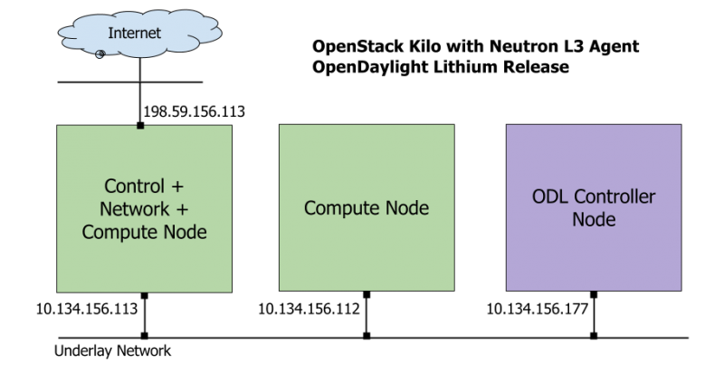

========================
Preparing Infrastructure
========================

********************
Architectural Design
********************

The architectural design of using a service VM as an IPv6 vRouter is
shown as follows in :numref:`figure1`:

.. figure:: images/ipv6-architecture.png
   :name: figure1
   :width: 100%

   Architectural Design of Using a VM as an IPv6 vRouter

********************
Infrastructure Setup
********************

In order to set up the service VM as an IPv6 vRouter, we need to
prepare 3 hosts, each of which has minimum 8GB RAM and 40GB storage. One host is used as OpenStack Controller
Node. The second host is used as Open Daylight Controller Node. And the third one is used as
OpenStack Compute Node.

For exemplary purpose, we give them hostnames ``opnfv-odl-controller``,
``opnfv-os-controller``, and ``opnfv-os-compute`` respectively.

The underlay network topology of those 3 hosts are shown as follows in :numref:`figure2`:



   Underlay Network Topology

**Please note that the IP address shown in** ``:numref:`figure2```
**are for exemplary purpose. You need to configure your public IP
address connecting to Internet according to your actual network
infrastructure. And you need to make sure the private IP address are
not conflicting with other subnets**.
