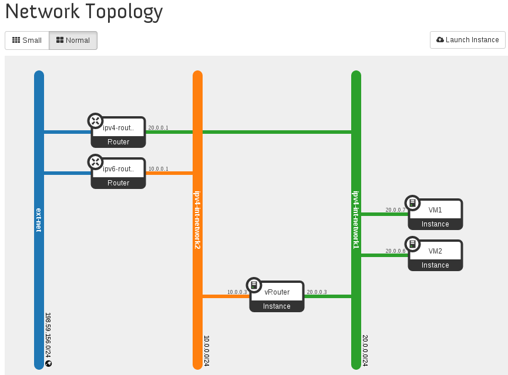

==========================================
Setting Up a Service VM as an IPv6 vRouter
==========================================

Now we can start to set up a service VM as an IPv6 vRouter. For exemplary purpose, we assume:

* The hostname of  Open Daylight Controller Node is ``opnfv-odl-controller``
* The hostname of OpenStack Controller Node is ``opnfv-os-controller``
* The hostname of OpenStack Compute Node is ``opnfv-os-compute``
* We use ``opnfv`` as username to login.
* We use ``devstack`` to install OpenStack Kilo, and the directory is ``~/devstack``
* Note: all IP addresses as shown below are for exemplary purpose.

***************************************************
Source the Credentials in OpenStack Controller Node
***************************************************

**SETUP-SVM-1**: Login with username ``opnfv`` in OpenStack Controller Node ``opnfv-os-controller``.
Start a new terminal, and change directory to where OpenStack is installed.

   ``cd ~/devstack``

**SETUP-SVM-2**: Source the credentials.

   ``opnfv@opnfv-os-controller:~/devstack$ source openrc admin demo``

**************************************
Add External Connectivity to ``br-ex``
**************************************

Because we need to manually create networks/subnets to achieve the IPv6 vRouter, we have used the flag
``NEUTRON_CREATE_INITIAL_NETWORKS=False`` in ``local.conf`` file. When this flag is set to False,
``devstack`` does not create any networks/subnets during the setup phase.

In OpenStack Controller Node ``opnfv-os-controller``, ``eth1`` is configured to provide external/public connectivity
for both IPv4 and IPv6. So let us add this interface to ``br-ex`` and move the IP address, including the default route
from ``eth1`` to ``br-ex``.

**SETUP-SVM-3**: Add ``eth1`` to ``br-ex`` and move the IP address and the default route from ``eth1`` to ``br-ex``

   ``sudo ip addr del <External IP address of opnfv-os-controller> dev eth1 && sudo ovs-vsctl add-port br-ex eth1 && sudo ifconfig eth1 up && sudo ip addr add <External IP address of opnfv-os-controller> dev br-ex && sudo ifconfig br-ex up && sudo ip route add default via <Default gateway IP address of opnfv-os-controller> dev br-ex``

* Note: This can be automated in /etc/network/interfaces.

**SETUP-SVM-4**: Verify that ``br-ex`` now has the original external IP address, and that the default route is on ``br-ex``

   ``opnfv@opnfv-os-controller:~/devstack$ ip a s br-ex``
|   38: br-ex: <BROADCAST,UP,LOWER_UP> mtu 1430 qdisc noqueue state UNKNOWN group default 
|       link/ether 00:50:56:82:42:d1 brd ff:ff:ff:ff:ff:ff
|       inet 198.59.156.113/24 brd 198.59.156.255 scope global br-ex
|          valid_lft forever preferred_lft forever
|       inet6 fe80::543e:28ff:fe70:4426/64 scope link
|          valid_lft forever preferred_lft forever

   ``opnfv@opnfv-os-controller:~/devstack$ ip route``
|   default via 198.59.156.1 dev br-ex
|   10.134.156.0/24 dev eth0  proto kernel  scope link  src 10.134.156.113
|   192.168.122.0/24 dev virbr0  proto kernel  scope link  src 192.168.122.1
|   198.59.156.0/24 dev br-ex  proto kernel  scope link  src 198.59.156.113

* Note: The IP addresses above are exemplary purpose

********************************************************
Create IPv4 Subnet and Router with External Connectivity
********************************************************

**SETUP-SVM-5**: Create a Neutron router ``ipv4-router`` which needs to provide external connectivity.

    ``neutron router-create ipv4-router``

**SETUP-SVM-6**: Create an external network/subnet ``ext-net`` using the appropriate values based on the
data-center physical network setup.

   ``neutron net-create --router:external ext-net``

   ``neutron subnet-create --disable-dhcp --allocation-pool start=198.59.156.251,end=198.59.156.254 --gateway 198.59.156.1 ext-net 198.59.156.0/24``

* Note: The IP addresses in the command above are for exemplary purpose. **Please replace the IP addresses of your actual network**.

**SETUP-SVM-7**: Associate the ``ext-net`` to the Neutron router ``ipv4-router``.

   ``neutron router-gateway-set ipv4-router ext-net``

**SETUP-SVM-8**: Create an internal/tenant IPv4 network ``ipv4-int-network1``

   ``neutron net-create ipv4-int-network1``

**SETUP-SVM-9**: Create an IPv4 subnet ``ipv4-int-subnet1`` in the internal network ``ipv4-int-network1``

   ``neutron subnet-create --name ipv4-int-subnet1 --dns-nameserver 8.8.8.8 ipv4-int-network1 20.0.0.0/24``

* Note: The IP addresses in the command above are for exemplary purpose. **Please replace the IP addresses of your
actual network**

**SETUP-SVM-10**: Associate the IPv4 internal subnet ``ipv4-int-subnet1`` to the Neutron router ``ipv4-router``. 

   ``neutron router-interface-add ipv4-router ipv4-int-subnet1``

********************************************************
Create IPv6 Subnet and Router with External Connectivity
********************************************************

Now, let us create a second neutron router where we can "manually" spawn a ``radvd`` daemon to simulate an external IPv6 router. 

**SETUP-SVM-11**:  Create a second Neutron router ``ipv6-router`` which needs to provide external connectivity

   ``neutron router-create ipv6-router``

**SETUP-SVM-12**: Associate the ``ext-net`` to the Neutron router ``ipv6-router`` 

   ``neutron router-gateway-set ipv6-router ext-net``

**SETUP-SVM-13**: Create a second internal/tenant IPv4 network ``ipv4-int-network2``

   ``neutron net-create ipv4-int-network2``

**SETUP-SVM-14**: Create an IPv4 subnet ``ipv4-int-subnet2`` for the ``ipv6-router`` internal network ``ipv4-int-network2``

   ``neutron subnet-create --name ipv4-int-subnet2 --dns-nameserver 8.8.8.8 ipv4-int-network2 10.0.0.0/24``

* Note: The IP addresses in the command above are for exemplary purpose. **Please replace the IP addresses of your actual network**

**SETUP-SVM-15**: Associate the IPv4 internal subnet ``ipv4-int-subnet2`` to the Neutron router ``ipv6-router``.

   ``neutron router-interface-add ipv6-router ipv4-int-subnet2``

**************************************************
Prepare Image, Metadata and Keypair for Service VM
**************************************************

**SETUP-SVM-16**: Download ``fedora20`` image which would be used as ``vRouter``

   ``glance image-create --name 'Fedora20' --disk-format qcow2 --container-format bare --is-public true --copy-from http://cloud.fedoraproject.org/fedora-20.x86_64.qcow2``

**SETUP-SVM-17**: Create a keypair

   ``nova keypair-add vRouterKey > ~/vRouterKey``

**SETUP-SVM-18**: Copy the contents from the following url to ``metadata.txt``, i.e. preparing metadata which enables
IPv6 router functionality inside ``vRouter``

   ``http://fpaste.org/303942/50781923/``

* Note: this ``metadata.txt`` will enable the ``vRouter`` to automatically spawn a ``radvd`` daemon, which advertises its IPv6 subnet
prefix ``2001:db8:0:2::/64`` in RA (Router Advertisement) message through its ``eth1`` interface to other VMs on ``ipv4-int-network1``.
The ``radvd`` daemon also advertises the routing information, which routes to ``2001:db8:0:2::/64`` subnet, in RA (Router Advertisement)
message through its ``eth0`` interface to ``eth1`` interface of ``ipv6-router`` on ``ipv4-int-network2``.

**********************************************************************************************************
Boot Service VM (``vRouter``) with ``eth0`` on ``ipv4-int-network2`` and ``eth1`` on ``ipv4-int-network1``
**********************************************************************************************************

Let us boot the service VM (``vRouter``) ``eth0`` interface on ``ipv4-int-network2`` connecting to ``ipv6-router``,
and ``eth1`` interface on ``ipv4-int-network1`` connecting to ``ipv4-router``.

**SETUP-SVM-19**: Boot the ``vRouter`` using ``Fedora20`` image on the OpenStack Compute Node with hostname ``opnfv-os-compute``

   ``nova boot --image Fedora20 --flavor m1.small --user-data ./metadata.txt --availability-zone nova:opnfv-os-compute --nic net-id=$(neutron net-list | grep -w ipv4-int-network2 | awk '{print $2}') --nic net-id=$(neutron net-list | grep -w ipv4-int-network1 | awk '{print $2}') --key-name vRouterKey vRouter``

**SETUP-SVM-20**: Verify that ``Fedora20`` image boots up successfully and the ssh keys are properly injected

   ``nova list``

   ``nova console-log vRouter``

* Note: It may take few minutes for the necessary packages to get installed and ssh keys to be injected.

   ``# Sample Output``
|   [  762.884523] cloud-init[871]: ec2: #############################################################
|   [  762.909634] cloud-init[871]: ec2: -----BEGIN SSH HOST KEY FINGERPRINTS-----
|   [  762.931626] cloud-init[871]: ec2: 2048 e3:dc:3d:4a:bc:b6:b0:77:75:a1:70:a3:d0:2a:47:a9   (RSA)
|   [  762.957380] cloud-init[871]: ec2: -----END SSH HOST KEY FINGERPRINTS-----
|   [  762.979554] cloud-init[871]: ec2: #############################################################

*******************************************
Boot Two Other VMs in ``ipv4-int-network1``
*******************************************

In order to verify that the setup is working, let us create two cirros VMs with ``eth1`` interface on the ``ipv4-int-network1``,
i.e., connecting to ``vRouter`` ``eth1`` interface for internal network.

We will have to configure appropriate ``mtu`` on the VMs' interface by taking into account the tunneling overhead and any
physical switch requirements. If so, push the ``mtu`` to the VM either using ``dhcp`` options or via ``meta-data``.

**SETUP-SVM-21**: Create VM1 on OpenStack Controller Node with hostname ``opnfv-os-controller``

   ``nova boot --image cirros-0.3.4-x86_64-uec --flavor m1.tiny --nic net-id=$(neutron net-list | grep -w ipv4-int-network1 | awk '{print $2}') --availability-zone nova:opnfv-os-controller --key-name vRouterKey VM1``

**SETUP-SVM-22**: Create VM2 on OpenStack Compute Node with hostname ``opnfv-os-compute``

   ``nova boot --image cirros-0.3.4-x86_64-uec --flavor m1.tiny --nic net-id=$(neutron net-list | grep -w ipv4-int-network1 | awk '{print $2}') --availability-zone nova:opnfv-os-compute --key-name vRouterKey VM2``

**SETUP-SVM-23**: Confirm that both the VMs are successfully booted.

   ``nova list``

   ``nova console-log VM1``

   ``nova console-log VM2``

**********************************
Spawn ``RADVD`` in ``ipv6-router``
**********************************

Let us manually spawn a ``radvd`` daemon inside ``ipv6-router`` namespace to simulate an external router. First of all,
we will have to identify the ``ipv6-router`` namespace and move to the namespace.

**SETUP-SVM-24**: identify the ``ipv6-router`` namespace and move to the namespace

   ``sudo ip netns exec qrouter-$(neutron router-list | grep -w ipv6-router | awk '{print $2}') bash``

**SETUP-SVM-25**: Upon successful execution of the above command, you will be in the router namespace. Now let us configure
the IPv6 address on the <qr-xxx> interface.

   ``router_interface=$(ip a s | grep -w "global qr-*" | awk '{print $7}')``

   ``ip -6 addr add 2001:db8:0:1::1 dev $router_interface``

**SETUP-SVM-26**: Copy the following contents to some file, e.g. ``/tmp/br-ex.radvd.conf``

.. code-block::

   interface $router_interface
     {
        AdvSendAdvert on;
        MinRtrAdvInterval 3;
        MaxRtrAdvInterval 10;
        prefix 2001:db8:0:1::/64
          {
             AdvOnLink on;
             AdvAutonomous on;
          };
     };

**SETUP-SVM-27**: Spawn a ``radvd`` daemon to simulate an external router. This ``radvd`` daemon advertises its IPv6
subnet prefix ``2001:db8:0:1::/64`` in RA (Router Advertisement) message through its ``eth1`` interface to ``eth0``
interface of ``vRouter`` on ``ipv4-int-network2``.

   ``$radvd -C /tmp/br-ex.radvd.conf -p /tmp/br-ex.pid.radvd -m syslog``

**SETUP-SVM-28**: Configure the ``$router_interface`` process entries to process the RA (Router Advertisement) message from
``vRouter``, and automatically add a downstream route pointing to the LLA (Link Local Address) of ``eth0`` interface of the
``vRouter``.

.. code-block::

   sysctl -w net.ipv6.conf.$router_interface.accept_ra=2
   sysctl -w net.ipv6.conf.$router_interface.accept_ra_rt_info_max_plen=64

**SETUP-SVM-29**: Please note that after the vRouter successfully initializes and starts sending RA (Router Advertisement)
message (**SETUP-SVM-20**), you would see an IPv6 route to the ''2001:db8:0:2::/64'' prefix (subnet) reachable via LLA
(Link Local Address) of ``eth0`` interface of the ``vRouter``. You can execute the following command to list the IPv6 routes.

   ``ip -6 route show``

********************************
Testing to Verify Setup Complete
********************************

Now, let us ``ssh`` to one of the VMs, e.g. VM1, to confirm that it has successfully configured the IPv6 address using
``SLAAC`` with prefix ``2001:db8:0:2::/64`` from ``vRouter``.

   * Note: You need to get the IPv4 address associated to VM1. This can be inferred from ``nova list`` command.

**SETUP-SVM-30**: ``ssh`` VM1

   ``ssh -i /home/odl/vRouterKey cirros@<VM1-IPv4-address>``

If everything goes well, ``ssh`` will be successful and you will be logged into VM1. Run some commands to verify
that IPv6 addresses are configured on ``eth0`` interface. 

**SETUP-SVM-31**: Show an IPv6 address with a prefix of ``2001:db8:0:2::/64``

   ``ip address show``

**SETUP-SVM-32**: ping some external IPv6 address, e.g. ``ipv6-router``

   ``ping6 2001:db8:0:1::1``

If the above ping6 command succeeds, it implies that ``vRouter`` was able to successfully forward the IPv6 traffic
to reach external ``ipv6-router``.

**SETUP-SVM-33**: When all tests show that the setup works as expected, You can now exit the ``ipv6-router`` namespace.

   ``exit``

**********
Next Steps
**********

Congratulations, you have completed the setup of using a service VM to act as an IPv6 vRouter. This setup allows further
open innovation by any 3rd-party. Please refer to relevant sections in User's Guide for further value-added services on
this IPv6 vRouter.

********************************************************
Sample Network Topology of this Setup through Horizon UI
********************************************************

The sample network topology of above setup is shown in Horizon UI as follows :numref:`figure3`:

   Sample Network Topology in Horizon UI

