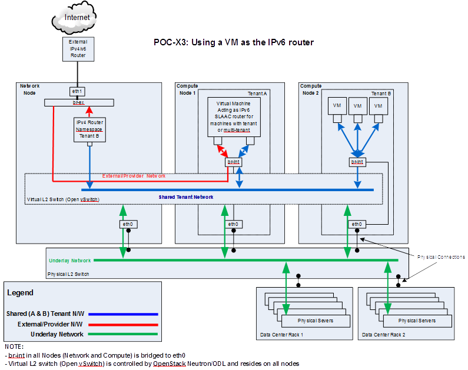

.. This work is licensed under a Creative Commons Attribution 4.0 International License.
.. http://creativecommons.org/licenses/by/4.0
.. (c) Bin Hu (AT&T) and Sridhar Gaddam (RedHat)

====================
Architectural Design
====================

The architectural design of using a service VM as an IPv6 vRouter is
shown as follows in :numref:`arch-figure1`:

   Architectural Design of Using a VM as an IPv6 vRouter

This design applies to deployment model of single controller node as well as HA (High Availability)
deployment model of multiple controller nodes.

