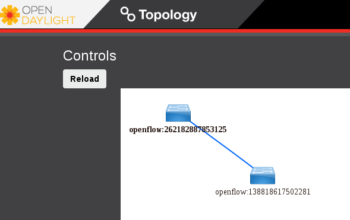

============================
Network Topology After Setup
============================

********************************************************
Sample Network Topology of this Setup through Horizon UI
********************************************************

The sample network topology of the setup will be shown in Horizon UI as follows :numref:`setup-figure1`:

.. figure:: images/ipv6-sample-in-horizon.png
   :name: setup-figure1
   :width: 100%

   Sample Network Topology in Horizon UI

*********************************************************
Sample Network Topology of this Setup through ODL DLUX UI
*********************************************************

If you set up either Scenario 2 or Scenario 3, the sample network topology of the setup
will be shown in Open Daylight DLUX UI as follows :numref:`s23-figure1`:

   Sample Network Topology in Open Daylight DLUX UI

